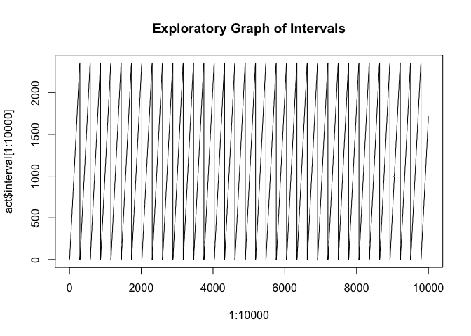
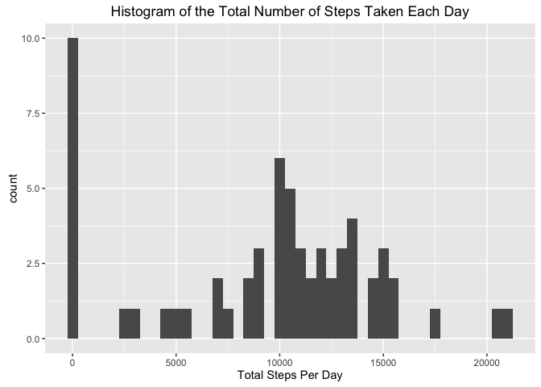
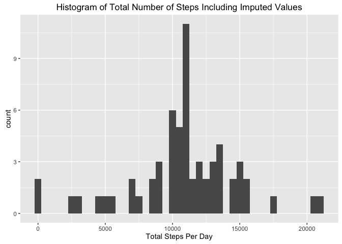
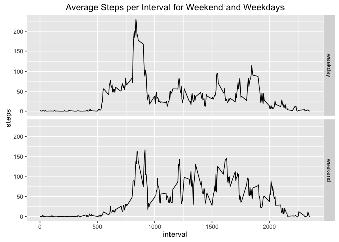

# Reproducible Research: Peer Assessment 1

## Loading and preprocessing the data

The data was loaded from the file and some information extracted about the data to get some more understanding.  The date was changed to Date class.

```r
act <- read.csv("activity.csv")
str(act)
```

```
## 'data.frame':	17568 obs. of  3 variables:
##  $ steps   : int  NA NA NA NA NA NA NA NA NA NA ...
##  $ date    : Factor w/ 61 levels "2012-10-01","2012-10-02",..: 1 1 1 1 1 1 1 1 1 1 ...
##  $ interval: int  0 5 10 15 20 25 30 35 40 45 ...
```

```r
act$date <- as.Date(act$date, "%Y-%m-%d")
range(act$steps, na.rm=TRUE)
```

```
## [1]   0 806
```

```r
range(act$interval, na.rm=TRUE)
```

```
## [1]    0 2355
```

```r
plot(1:10000, act$interval[1:10000], type="l", main="Exploratory Graph of Intervals")
```

<!-- -->

```r
plot(1:10000, act$steps[1:10000], type="l", main="Exploratory Graph of Steps")
```

<!-- -->

## What is the mean total number of steps taken per day?
For this part of the assignment the missing values were ignored.  When plotting the histogram of total steps per day a couple of bin widths were tried and 500 was selected for the final graph.


```r
library(ggplot2)
# Total number of steps taken each day
tot_steps_day <- aggregate(act$steps, list(Date = act$date), sum, na.rm=TRUE)
range(tot_steps_day$x, na.rm=TRUE)
```

```
## [1]     0 21194
```

```r
ggplot(tot_steps_day, aes(x=x)) + geom_histogram(binwidth=500) + xlab("Total Steps Per Day") + ggtitle("Histogram of the Total Number of Steps Taken Each Day")
```

<!-- -->

```r
mean_steps <- mean(tot_steps_day$x, na.rm=TRUE)
median_steps <- median(tot_steps_day$x, na.rm=TRUE)
```
### Mean and Median Number of Steps Taken Each Day

```
## [1] "Mean total steps per day:  9354.23"
```

```
## [1] "Median total steps per day:  10395"
```

## What is the average daily activity pattern?
The mean of steps was taken for each interval and plotted in a time series.  The maximum mean number of steps was found using the max function and the index of that row used to output the interval and the mean number of steps for that interval.


```r
msi <- aggregate(act$steps, list(interval=act$interval), FUN=mean, na.rm=TRUE)
names(msi)[2] <- "steps"
ggplot(msi, aes(interval, steps)) + geom_line() + xlab("Interval") + ylab("Mean Steps") + ggtitle("Mean Steps Per Interval Averaged Across All Days")
```

<!-- -->

```r
msi_interval <- msi[which.max(msi$steps),1]
msi_value <- msi[which.max(msi$steps),2]
```
### The 5-minute interval that, on average, contains the maximum number of steps

```
## [1] "The interval with the maximum number of steps on average is:  835"
```

```
## [1] "And the average number of steps in that interval is:  206.17"
```
## Imputing missing values


```r
# Count the number of NA values in the steps column.
paste("The number of rows with NAs is: ", sum(is.na(act$steps)))
```

```
## [1] "The number of rows with NAs is:  2304"
```
### Strategy used for imputing missing values
The strategy adopted to impute values for the 2304 NAs in the dataset was to use the average number of steps for that interval which had already been calculated.  A temporary dataset was created by merging the original data set with the mean steps per interval data then the steps values for the NA rows were copied to the original "steps" column.  The temporary dataset was then deleted.  This resulted in a change of class for the steps column variable from integer to numeric.


```r
library("dplyr")
merge <- left_join(act, msi, by="interval", suffix = c(".act", ".mean") )
missing_idx = which(is.na(act$steps))
act[missing_idx, "steps"] <- merge[missing_idx, "steps.mean"]
rm(merge)

# Repeat the calculations from previously
ntot_steps_day <- aggregate(act$steps, list(Date = act$date), sum)
ggplot(ntot_steps_day, aes(x=x)) + geom_histogram(binwidth=500) + xlab("Total Steps Per Day") + ggtitle("Histogram of Total Number of Steps Including Imputed Values")
```

<!-- -->

```r
nmean_steps <- mean(ntot_steps_day$x)
nmedian_steps <- median(ntot_steps_day$x)
```


```
## [1] "New mean total steps per day:  10766.19 compare to original value of:   9354.23"
```

```
## [1] "New median total steps per day:  10766.19 compare to original value of:   10395"
```
So it can be seen that imputing the missing values using the average value for the interval causes both the mean and the median values to increase.

## Are there differences in activity patterns between weekdays and weekends?

A factor variable "daytype" was created that has the value "weekend" for Saturdays and Sundays and "weekday" otherwise.  The time series was plotted as averages per interval for weekdays and weekend days.

```r
act$daytype <- factor(ifelse(weekdays(act$date) %in% c("Saturday", "Sunday"), "weekend", "weekday"))
act_grp <- group_by(act, interval, daytype)
ggplot(act_grp, aes(interval, steps)) + 
    stat_summary(fun.y="mean", geom="line") + 
    facet_grid(daytype~.) + 
    ggtitle("Average Steps per Interval for Weekend and Weekdays")
```

<!-- -->
